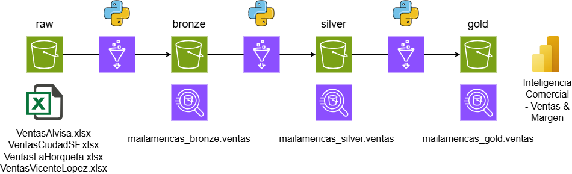
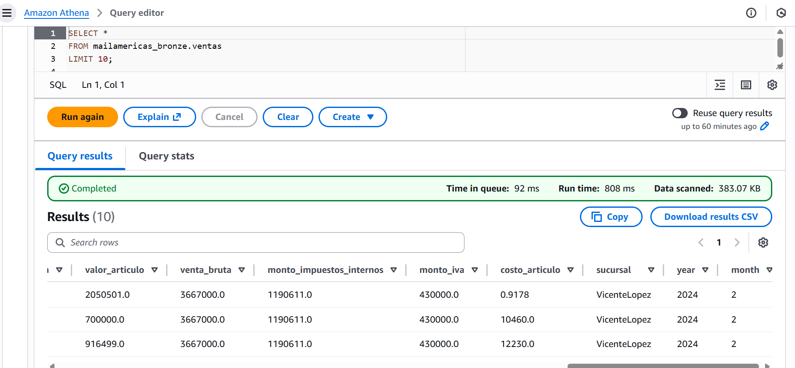
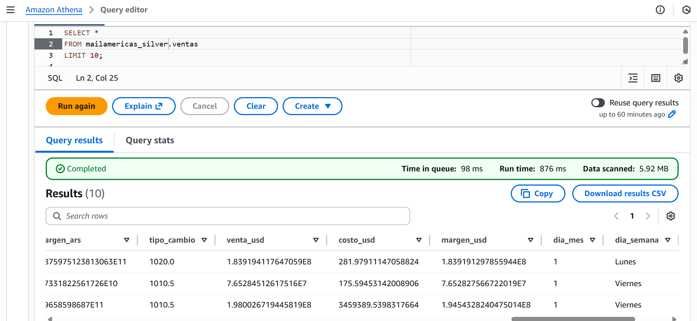
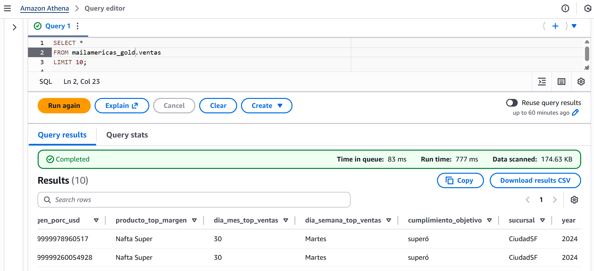
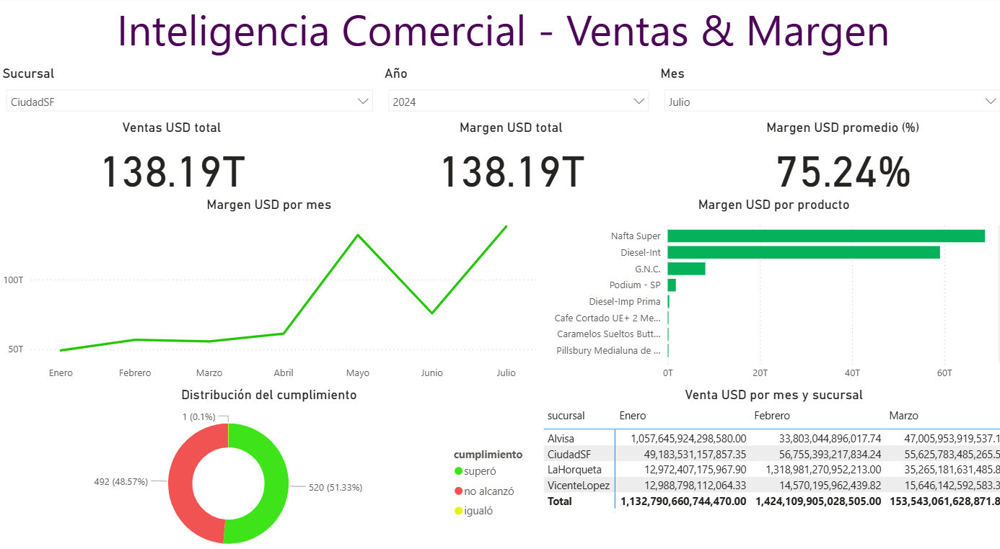

# MailAmericas – Ventas Data Pipeline (AWS Lakehouse)

**Autor:** Italo Contreras Pérez  
**Rol:** Senior Data Engineer  
**Stack:** AWS Glue, S3, Athena, Python, PyArrow, Pandas, Power BI

---

## 🏗️ Descripción 

El proyecto implementa un pipeline de datos de ventas multi-capa (**Raw → Bronze → Silver → Gold**) en AWS, diseñado para transformar y analizar la información de ventas proveniente de archivos Excel (.xlsx) por sucursal.  

Cada capa representa un nivel de calidad, granularidad y preparación de datos para su uso analítico en **Athena**, **Power BI** y posibles chatbots de AI basados en datos.

---

## 📌 Arquitectura

---

## 🔁 Flujo General

| Capa | Descripción | Ubicación | Script Glue |
|------|--------------|------------|--------------|
| **Raw** | Archivos .xlsx originales por sucursal. | `s3://mailamericas-datalake/raw/ventas/` | — |
| **Bronze** | Limpieza, estandarización y Parquet particionado. | `s3://mailamericas-datalake/bronze/ventas/` | `ventas_ingest_raw_to_bronze.py` |
| **Silver** | Enriquecimiento con tipo de cambio y variables temporales. | `s3://mailamericas-datalake/silver/ventas/` | `ventas_transform_bronze_to_silver.py` |
| **Gold** | Agregación mensual por producto (margen, cumplimiento, KPIs). | `s3://mailamericas-datalake/gold/ventas_analiticas/` | `ventas_aggregate_silver_to_gold.py` |

---

## ⚙️ Scripts principales

### 1️⃣ ventas_ingest_raw_to_bronze.py
- Lee archivos Excel (.xlsx) desde S3 Raw.  
- Limpia encabezados y normaliza nombres de columnas.  
- Convierte los datos a **Parquet** comprimido (Snappy).  
- Particiona por `sucursal/year/month`.  
- Incluye manejo de errores y logging detallado.

### 2️⃣ ventas_transform_bronze_to_silver.py
- Lee Parquets desde Bronze.  
- Calcula métricas financieras (ARS → USD).  
- Agrega tipo de cambio (`exchange_rate_ars_usd_2024.csv`).  
- Añade columnas `DIA_MES` y `DIA_SEMANA`.  
- Escribe nuevamente en formato Parquet particionado.

### 3️⃣ ventas_aggregate_silver_to_gold.py
- Agrega métricas a nivel mensual y por producto:  
  - Margen total y porcentual.  
  - Cumplimiento del objetivo de margen (`>70%` = “superó”).  
- Escribe salida particionada en capa GOLD.
- Genera columna MONTH_NAME para dashboards.

---

## 🧠 Scripts SQL (Athena)

| Archivo | Descripción |
|----------|--------------|
| `create_bronze_table.sql` | Crea tabla externa en Athena sobre S3 Bronze. |
| `create_silver_table.sql` | Crea tabla externa en Athen sobre S3 Silver. |
| `create_gold_table.sql` | Crea tabla externa en Athena sobre S3 Gold. |
| `create_reference_table.sql` | Crea tabla en Athena de tipo de cambio. |

---

## 🧱 Buenas prácticas

- Diseño Lakehouse real (S3 + Glue + Athena).
- Formato columnar Parquet + Snappy.
- Particionamiento para bajo costo y alto rendimiento.
- Validaciones de esquema en cada etapa.
- Logging y manejo de excepciones detallado.
- Cálculo mensual por producto (ventas, costos, márgenes).
- Métricas para dashboards e IA:
  - Cumplimiento objetivo
  - Month_name
  - Agregaciones por sucursal

---

## 📊 Capturas de Tablas

mailamericas_bronze.ventas

mailamericas_silver.ventas

mailamericas_gold.ventas

---

## 📈 Dashboard Power BI

Este dashboard utiliza directamente la tabla GOLD desde Athena como origen y tiene como filtros: sucursal, año y mes.

Incluye visualizaciones como:

- KPIs: ventas, margen y margen promedio (%)

- Tendencia de margen por mes

- Margen por producto

- Distribución del cumplimiento

- Tendencia de venta por mes y sucursal

